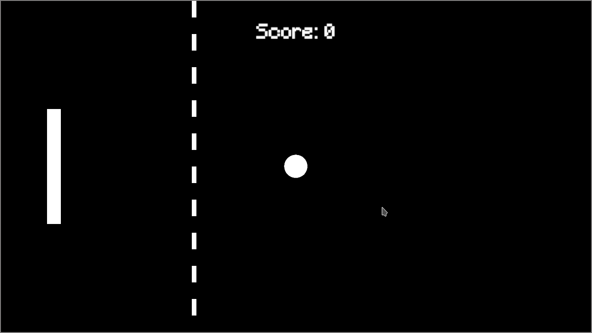

# Pong Solo
This is a recreation of an old project of Pong, but solo. Now made in Rust.

The game consists of a player who has to hit the ball that hits the wall and comes back, if the ball hits the left wall behind the player, the game ends and you lose.

At each point the ball's speed increases by 50 and the player's by 20. Over time the game will come down to reflex and precision

### Preview

### Dependencies
- [piston](https://crates.io/crates/piston) - Game engine for Rust
- [piston_window](https://crates.io/crates/piston_window) - Window wrapper for piston game engine
- [rand](https://crates.io/crates/rand) - Random values